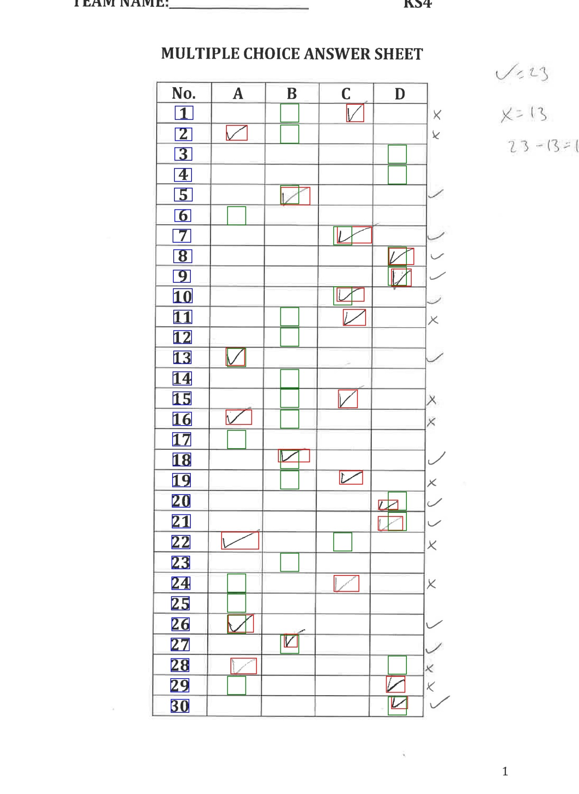
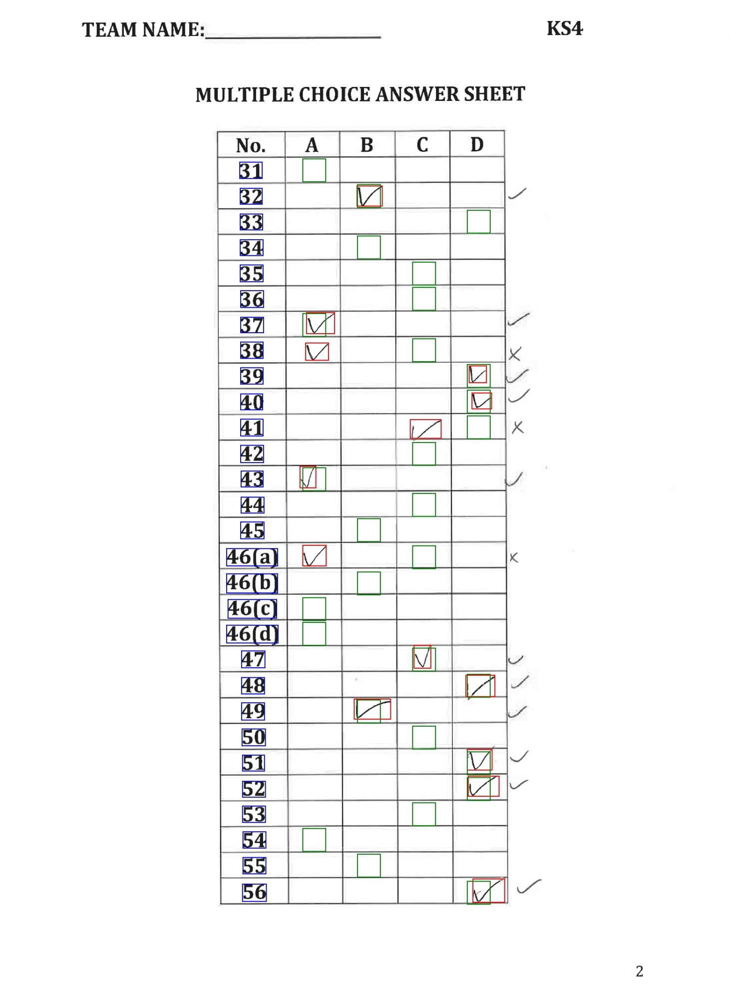
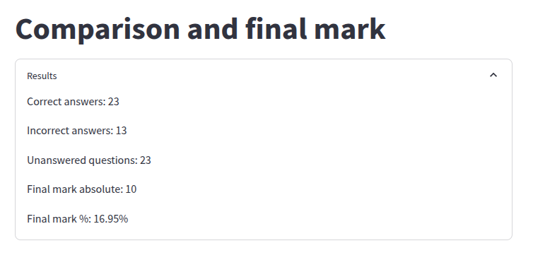

# Vision.OPT_MULT

Project for automatically marking multiple choice questionnaires. This was used in the Royal Society of Chemistry `Top of the Bench' competition for the multiple choice papers. 

This code needs some custom classes

## Method

The docker container executes a simple stream
 
The code executes as follows:
 - Detect all vertical and horizontal gridlines (using hough transform)
 - Crop each question row into a separate image using the gridlines
 - Detect the question number and coordinates of the ticks or crosses using an object detector
 - Convert both the markscheme image and the image of the student test to pandas dataframes
 - Compare the dataframes to return a mark

## Model training

Data was labelled with CVAT. 

The model used is Yolov5, which I forked, made into a package, and cloned into my workspace. 

https://github.com/OliverSchamp/yolov5

## Examples in execution

This is an example image of a marked scan.

## Dockerfile

The dockerfile included was for CPU only so I could run it on my laptop.